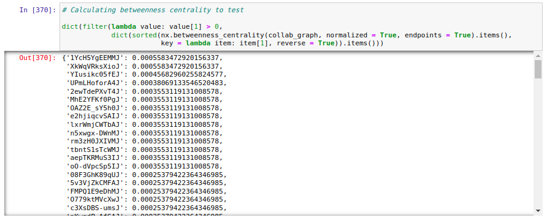

# Network Analysis of AI x Climate Change papers on Google Scholar

## About the project

Since I would like to study AI methods and their application in Climate change mitigation and adaptation, for this coursework, I tried to analyze relevant papers and their authors as social networks.


## Main results and methods used

### 1. Reading and analyzing initial data with Python and Pandas


### 2. Preprocessing and cleaning data with Pandas


### 3. Creating a graph with trios of (paper_1, paper_2, common_authors) with Networkx


### 4. Calculating betweenness and other centralities with Networkx



### 5. Visualizing the graph with Matplotlib


### 6. Modifying the graph and adding visual aids with Networkx and Matplotlib


## To replicate the results

### Requirements

```
pip install -r requirements.txt
```

After preparing the environment, please start the jupyter notebook [sna-ai-climate-change-papers.ipynb](https://github.com/gereltuya/sna-ai-climate-change-papers/blob/main/sna-ai-climate-change-papers.ipynb) and follow the code steps.

### Data

To run the data collection step in the notebook, you need to add your own SerpApi token, but you can skip the step and work on the downloaded data in the [data/](https://github.com/gereltuya/sna-ai-climate-change-papers/tree/main/data) folder.

### Code

Data preprocessing, cleaning, and analysis code was written from scratch by me.

Core of the Social network analysis code was taken from this [project by Julia Wu](https://github.com/hw355/sna_twitter), as used by me [on a similar coursework](https://github.com/gereltuya/sna-mongolia-tweets).
